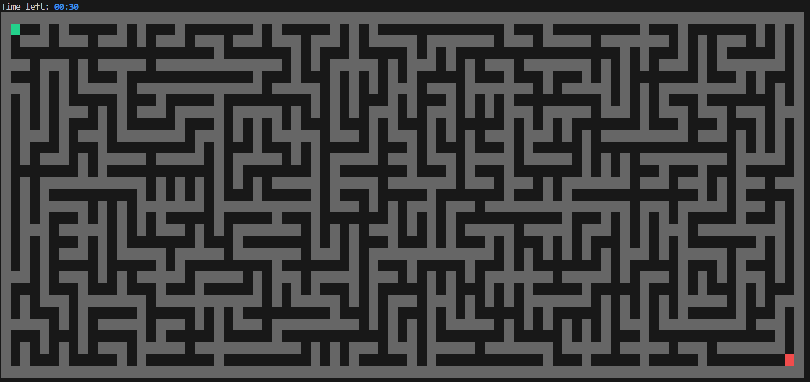
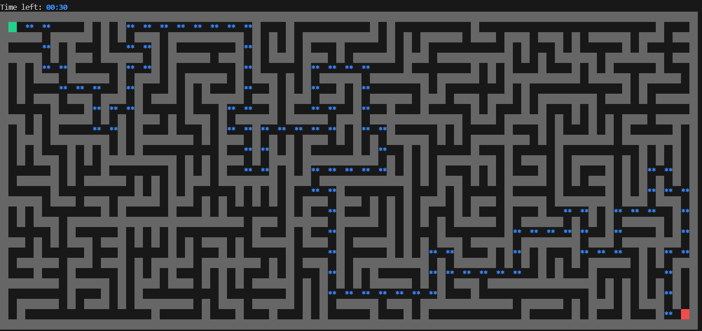

# Threadmaze

**Threadmaze** est un projet personnel développé en C dont le but est de créer un **jeu de labyrinthe jouable directement dans la console**.
Il permet de **générer des labyrinthes aléatoires**, de **naviguer dedans en temps réel**, et d’utiliser un **solveur intelligent** pour trouver le chemin vers la sortie.


## Captures d'écran

### Exemple de labyrinthe


### Solveur A*



## Technologies utilisées

- **Langage :** C    
- **IDE :** Visual Studio  


## Équipe

- Nombre de développeurs : **1**  
- Durée du projet : **3 semaines**


## Installation et exécution

1. **Cloner le dépôt :**
    ```bash
    git clone https://github.com/mon-utilisateur/threadmaze.git
    cd threadmaze
2. **Lancer le jeu :**
    ```bash
    ./bin/maze-game
4. **Lancer le jeu avec différents paramètres :**
    ```bash
    ./bin/maze-game	                      Génère un labyrinthe de taille maximale sans limite de temps
    ./bin/maze-game 10	                  Taille max, avec un timer de 10 secondes
    ./bin/maze-game 5 6	                  Labyrinthe de 5×6 sans timer
    ./bin/maze-game 5 6 9	              Labyrinthe de 5×6 avec un timer de 9 secondes
    ./bin/maze-game -w 10 -h 9 -t 5	      Largeur=10, Hauteur=9, Timer=5s
    

## Fonctionnalités principales

- Génération aléatoire de labyrinthes à probabilité égale basée sur l’algorithme de Wilson
- Déplacement du joueur en temps réel dans la console
- Solveur intelligent basé sur l’algorithme A* pour trouver le chemin optimal
- Timer optionnel pour ajouter de la difficulté
- Système d'indice “hint” dynamique : affiche temporairement le chemin optimal entre la position du joueur et la sortie
- Interface ligne de commande flexible avec options -w, -h, -t
