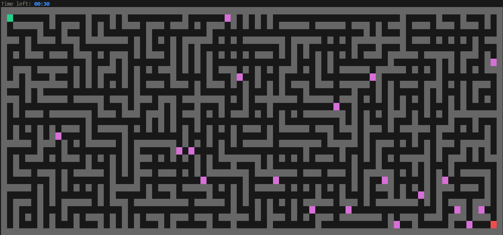

# Threadmaze

**Threadmaze** est un projet personnel développé en C dont le but est de créer un **jeu de labyrinthe complet jouable directement dans le terminal**.

Il permet de **générer des labyrinthes aléatoires** complexes, de **naviguer dedans en temps réel**, d'affronter des ennemis dotés d'IA, et d’utiliser un **solveur intelligent** pour trouver le chemin vers la sortie.


## Captures d'écran

### Exemple de labyrinthe


### Solveur A*


### Ennemis et labyrinthe avec boucles



## Architecture Technique & Synchronisation

Ce projet met en oeuvre des concepts avancés de programmation système :

- **Multi-threading** : Utilisation de la bibliothèque `pthread` pour gérer simultanément la logique du jeu, les timers et les événements asynchrones sans bloquer l'interface utilisateur.
- **Synchronisation Inter-processus** :
    - **Mutex (`pthread_mutex_t`)** : Garantissent l'intégrité des données partagées (état du labyrinthe, positions) lors des accès concurrents entre le thread principal et les threads secondaires.
    - **Variables de Condition (`pthread_cond_t`)** : Utilisées pour orchestrer les timers et réveiller les threads de manière efficace sans utiliser de boucles actives (busy-waiting), optimisant ainsi l'utilisation du CPU.
- **Signaux POSIX** : Gestion propre de l'interruption du programme (SIGINT / CTRL+C) pour assurer la libération correcte de la mémoire et la restauration du terminal avant la sortie.
- **Gestion Mémoire** : Allocation dynamique rigoureuse et nettoyage complet (Valgrind-clean) pour éviter les fuites de mémoire lors des rechargements de niveaux.


## Technologies utilisées

- **Langage :** C (Standard C99/C11)
- **Bibliothèques :** `pthread` (Threads), `math` (Calculs IA), `time` (Gestion du temps)
- **Rendu visuel :** Séquences d'échappement ANSI (Couleurs, curseur, nettoyage d'écran)
- **Compilation :** GCC & Make


## Contrôles par défaut

| Action            | Touche (Configurable)     |
| :---              | :---                      |
| **Haut**          | `Z`                       |
| **Bas**           | `S`                       |
| **Gauche**        | `Q`                       |
| **Droite**        | `D`                       |
| **Indice (Hint)** | `H`                       |
| **Quitter**       | `CTRL+C` ou via le menu   |


## Installation et exécution

> [!IMPORTANT]
> Ce projet repose sur des **mécanismes IPC (Inter-Process Communication)** spécifiques à Linux/Unix. Il ne fonctionnera pas nativement sous Windows sans un environnement type WSL (Windows Subsystem for Linux).

### Prérequis
Assurez-vous d'avoir `gcc` et `make` installés sur votre système Linux/WSL.

1. **Cloner le dépôt :**

    ```bash
    git clone https://github.com/D-l-E-G-O/threadmaze.git
    cd threadmaze
    ```

2. **Compilation :**

    ```bash
    make
    ```

2. **Lancer le jeu :**
    
    Cela ouvrira le menu principal avec la configuration par défaut (ou celle sauvegardée dans `settings.cfg`).

    ```bash
    ./bin/maze-game
    ```

4. **Options de lancement (CLI) :**

    Vous pouvez pré-charger des paramètres spécifiques dans le menu en utilisant des arguments.

    - **-w [taille]** : Définit la **largeur** du labyrinthe.
    - **-h [taille]** : Définit la **hauteur** du labyrinthe.
    - **-t [secondes]** : Définit la **durée du timer** (0 = désactivé).

    *Exemple : Lancer le menu pré-configuré pour un labyrinthe 10x9 avec un temps limité de 45s :*

    ```bash
    ./bin/maze-game -w 10 -h 9 -t 45
    ```

> [!NOTE] 
> Au premier lancement, un fichier `settings.cfg` sera automatiquement créé pour sauvegarder vos préférences (taille, touches, difficulté).

> [!IMPORTANT]
> La taille personnalisée du labyrinthe sera automatiquement ajustée si elle dépasse les dimensions actuelles de votre fenêtre de terminal. Pour les grands labyrinthes, pensez à dézoomer ou passer en plein écran.
    

## Fonctionnalités principales

- **Génération Avancée** : Labyrinthes parfaits via l'algorithme de Wilson, avec option de *Braiding* (création de boucles) pour des niveaux non linéaires.

- **Ennemis & IA** : Système d'ennemis dotés d'une intelligence artificielle hybride (Patrouille en zone + Poursuite A* lors de la détection du joueur).

- **Mutation Dynamique** : Le labyrinthe "vit" et change structurellement en temps réel (murs mouvants) selon une fréquence et quantité configurables.

- **Solveur Intelligent** : Système d'indice (*Hint*) dynamique calculant et affichant le chemin optimal via l'algorithme A*.

- **Contrôle Total** : Menu interactif complet permettant de configurer tous les paramètres du jeu (Dimensions du labyrinthe, Timer, Vitesse ennemis, Rayon de vision, Probabilité de boucles...).

- **Expérience Fluide** : Redimensionnement automatique à la fenêtre, rendu par couches (*Layers*) sans scintillement, et gestion propre des signaux (CTRL+C).

- **Système de Replay** : Menu de fin de partie permettant de rejouer exactement le même niveau (gestion de la graine aléatoire/Seed).

- **Flexible** : Lancement rapide via arguments CLI (-w, -h, -t) ou configuration détaillée via l'interface utilisateur.


## Équipe

- **Développeur** : Diego Aparicio
- **Statut** : En développement actif